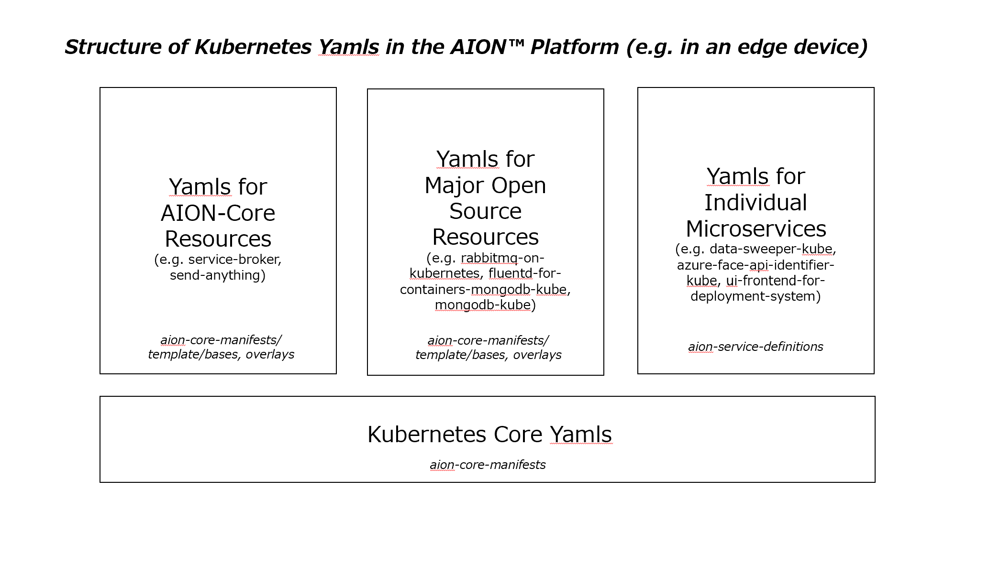

## **aion-core-manifests**
aion-core-manifests は aion-core および 関連リソース のデプロイ・稼働を行うために必要不可欠なマニフェストファイル群です。

aion-core および 関連リソース については[こちら](https://github.com/latonaio/aion-core)をご覧ください。
## 概要
[aion-coreのセットアップ](https://github.com/latonaio/aion-core)で作成したDocker Imagesからこれらのマニフェストファイルを元にaion-core および関連リソースを構成します。  
  
### AION の Kubernetes Yaml ファイルの構造（エッジデバイス内） 
AIONプラットフォームのあるエッジデバイス内において、Kubernetes Yaml ファイルは、次の領域に分かれています。

* Kubernetes コアのYamlファイル  

* AION-Core のYamlファイル  

* 主要なオープンソースリソース のYamlファイル  

* 個別マイクロサービス  のYamlファイル  




### AION の Kubernetes Yaml ファイルの所在
それぞれの Yamlファイルは、以下のレポジトリにあります。  

* Kubernetes コアのYamlファイル  >>>  [aion-core-manifests](https://github.com/latonaio/aion-core-manifests)  

* AION-Core のYamlファイル  >>>  [aion-core-manifests](https://github.com/latonaio/aion-core-manifests)  

* 主要なオープンソースリソース のYamlファイル  >>>  [aion-core-manifests](https://github.com/latonaio/aion-core-manifests)

* 個別マイクロサービス  のYamlファイル    >>>  [aion-service-definitions](https://github.com/latonaio/aion-service-definitions)


### template/bases、template/overlays  
template/bases は、(エッジ)Kubernetes環境を前提とした aion-core および 関連リソース の Kubernetes 定義ファイル群です。  
AION および 関連リソース をデプロイ・稼働するために必要なリソースが定義されます。   
定義されているリソースは、下記の通りです。   

* authorization  
* rabbitmq  
* fluentd  
* service-broker   
* mongo-express      

また、template overlays 下に、overlaysとして（エッジコンピューティング環境のために必要な）yamlファイルが配置されています。（ほとんどが最低限必要な初期値で構成されています）

### template/overlays/init_default/init_default.yml  

template/overlays/init_default には、AIONアーキテクチャ構成リソースの初期立ち上げとして必要なリソース(RabbitMQ) の 特別な init_default.yamlファイル が含まれています。  
AION において RabbitMQ を初期立ち上げすることが必要な理由は、aion-core および関連リソースの RabbitMQ への 依存度 が重要であるためです。  
なお、AION では、まず、init_default.yml の定義により、Rabbit-MQ が立ち上がります。その後、default.ymlの定義により、Rabbit MQ 以外の 各リソース が立ち上がります。

init_default.yml の生成ソース行は、 Makefile 内の 下記の箇所です。
```
kubectl kustomize template/overlays/init_default > generated/init_default.yml
```
  
参考として、default.yml の生成ソース行は、Makefile 内の 下記の箇所です。
```
kubectl kustomize template/overlays/default > generated/default.yml
```

### generated/yaml ファイルの生成  

以下のコマンドで、generated/yamlファイル（init_default.yml、default.yml、等）が生成されます。
```
make build
```
  
上記の通り、AION では、まず、init_default.yml の定義により、Rabbit-MQ が立ち上がります。その後、default.ymlの定義により、Rabbit MQ 以外の 各リソース が立ち上がります。  

### default.yml（生成後のサンプルファイル）    
aion-core-manifests の generated 下の default.yml に、サンプルとして、yamlファイルが配置されています。    

生成後の サンプル default.yml 内のリソースは、下記の通りです。（template の定義ファイルに基づいて生成されます）  

* ServiceAccount  
* ClusterRoleBinding  
* PersistentVolume  
* PersistentVolumeClaim  
* aion-servicebroker  
* aion-statuskanban  
* aion-kanban-replicator  
* aion-sendanything  
* Fluentd  
* Rediscluster 
* Envoy/Configmap  
* MongoDB  
* 各Deployment    

（※RabbitMQ のリソース は init_default.yml 内にあります）

## 前提条件・動作環境
aion-core-manifests の使用には aion-core のクローンが必要です。また Kubernetes が動作する必要があります。

* [aion-core](https://github.com/latonaio/aion-core)
* OS: Linux
* CPU: Intel64/AMD64/ARM64
* Kubernetes

### ノード一覧を取得
```shell
kubectl get node -o wide
```

## エッジ端末単体構成でのマニフェスト作成、AIONの起動/停止方法
### マニフェスト作成（generatedが生成されます）
```shell
make build
```

### AIONの起動
```shell
sh aion-start.sh
```

### AIONの停止
```shell
sh aion-stop.sh
```

## エッジクラスター構成でのマニフェスト作成、AIONのデプロイ/削除方法
### マニフェスト作成（generatedが生成されます）

`hostname` には配備するnodeのホスト名を使用してください
```shell
# master
make build-master HOST=$(hostname)

# worker
make build-worker HOST=$(hostname)
```

### AIONのデプロイ
```shell
# master
make apply-master

# worker
make apply-worker HOST=$(hostname)
```

### AIONの削除
```shell
# master
make delete-master

# worker
make delete-worker HOST=$(hostname)
```

## Port 番号 の 適用方針  
AIONプラットフォーム における Port 番号 の適用方針は、以下の通りです。  
AIONプラットフォームでは、Kubernetes の yml ファイルにおいてポート番号が定義されます。   
AION では、以下の通りに、マイクロサービス毎に Port番号 が定義されています。  

| type                 | Port固定の主要リソース       | aion-core / 個別のマイクロサービス(MS)      |   
| :------------------- | :------------------------- | :---------------------------------------- |   
| Envoy                | Redis -> 6379              | aion-core -> 10000(grpc) / 10001(admin)   |
|                      |                            | 個別MS -> 必要な場合、適宜Port番号を設定     |
| NodePort             | RabbitMQ -> 5672           | aion-core -> NodePort 利用なし             |
|                      | RabbitMQ(外部)->32094/32095| 個別MS ->：50500～50999をMS毎に分けて設定    |
|                      | MySQL -> 3306              | 個別MS(外部) ->：30500～30999を設定       　|
|                      | MySQL(外部) -> 30000       |                                            |
| ClusterIP            | Redis(envoyless) -> 6379   | aion-core -> ClusterIP 利用なし            |
|                      | MongoDB -> 27017           | 個別MS ->：50500～50999をMS毎に分けて設定   |
| Localhost            | ReactJS/Public -> 3000     | -                                         |
|                      | ReactJS/API -> 30080       | -                                         |
|                      | ReactJS/Websocket -> 30099 | -                                         |
|                      | ReactJS/ImagePath -> 30080 | -                                         |
|                      | ReactJS/Grpc -> 30050      | -                                         |